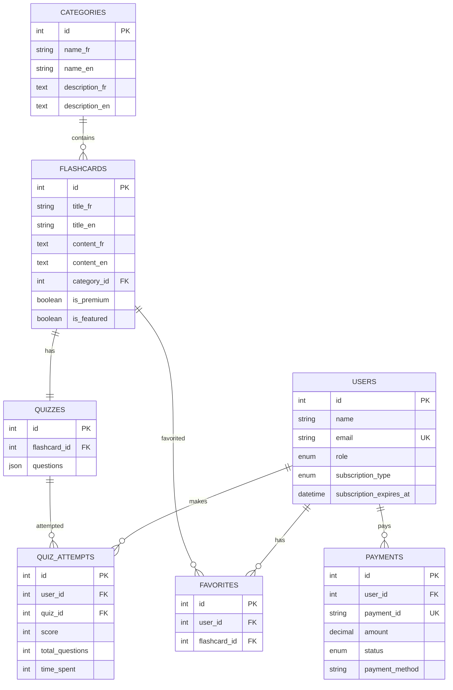

# 📋 CAHIER DES CHARGES - EDUFLASH

## 🎯 **PRÉSENTATION DU PROJET**

### **Nom du Projet**
**EduFlash** - Plateforme de Micro-Apprentissage Universitaire

### **Objectif Principal**
Développer une plateforme web moderne permettant aux étudiants d'accéder à des fiches de révision courtes et efficaces (flashcards) pour optimiser leur apprentissage.

### **Public Cible**
- **Primaire** : Étudiants universitaires (18-25 ans)
- **Secondaire** : Professionnels en formation continue
- **Tertiaire** : Lycéens préparant le baccalauréat

---

## 🔧 **SPÉCIFICATIONS TECHNIQUES**

### **Technologies Utilisées**
- **Framework** : Laravel 12.19.3
- **Base de Données** : MySQL
- **Frontend** : Blade Templates + Bootstrap 5
- **Authentification** : Laravel Breeze
- **PDF** : DomPDF
- **Cache** : File/Redis
- **Email** : SMTP/Log
- **Serveur** : Apache/Nginx + PHP 8.2+

### **Architecture**
```
MVC (Model-View-Controller)
├── Models (Eloquent ORM)
├── Controllers (Logique métier)
├── Views (Blade Templates)
├── Routes (Web + API)
├── Middleware (Sécurité)
└── Services (Logique complexe)
```

---

## 📊 **FONCTIONNALITÉS DÉVELOPPÉES**

### **🔐 AUTHENTIFICATION & SÉCURITÉ**
- [x] Inscription/Connexion utilisateur
- [x] Vérification email obligatoire
- [x] Récupération mot de passe
- [x] Gestion des rôles (User/Admin)
- [x] Protection CSRF
- [x] Middleware de sécurité

### **📚 GESTION DES CONTENUS**
- [x] Système de catégories multilingue
- [x] Flashcards avec contenu riche
- [x] Système de tags et métadonnées
- [x] Contenu premium/gratuit
- [x] Recherche avancée
- [x] Pagination optimisée

### **❤️ ENGAGEMENT UTILISATEUR**
- [x] Système de favoris
- [x] Quiz interactifs avec scoring
- [x] Tableau de bord personnalisé
- [x] Statistiques d'apprentissage
- [x] Historique des activités

### **💳 MONÉTISATION**
- [x] Abonnement Premium (mensuel/annuel)
- [x] Système de paiement multi-méthodes
  - Carte bancaire (Stripe)
  - PayPal
  - Virement bancaire
- [x] Gestion des abonnements
- [x] Contenu exclusif Premium

### **📄 FONCTIONNALITÉS PREMIUM**
- [x] Export PDF des flashcards
- [x] Téléchargement multiple
- [x] Accès illimité
- [x] Support prioritaire
- [x] Statistiques avancées

### **🌐 INTERNATIONALISATION**
- [x] Support multilingue (FR/EN)
- [x] Interface adaptative
- [x] Contenu localisé
- [x] Détection automatique langue

### **📱 RESPONSIVE DESIGN**
- [x] Interface mobile-first
- [x] Breakpoints optimisés
- [x] Navigation tactile
- [x] Performance mobile

### **⚡ PERFORMANCE & SEO**
- [x] Cache intelligent
- [x] Optimisation requêtes
- [x] Compression assets
- [x] URLs SEO-friendly
- [x] Meta tags dynamiques

### **👨‍💼 ADMINISTRATION**
- [x] Panel admin complet
- [x] Gestion des flashcards
- [x] Modération contenu
- [x] Analytics basiques
- [x] Gestion utilisateurs

---

## 🗄️ **STRUCTURE BASE DE DONNÉES**

### **Tables Principales**
```sql
users (id, name, email, role, subscription_type, subscription_expires_at)
categories (id, name_fr, name_en, description_fr, description_en)
flashcards (id, title_fr, title_en, content_fr, content_en, category_id, is_premium)
favorites (id, user_id, flashcard_id)
quizzes (id, flashcard_id, questions)
quiz_attempts (id, user_id, quiz_id, score, total_questions, time_spent)
payments (id, user_id, payment_id, amount, status, payment_method)
newsletter_subscriptions (id, email, subscribed_at)
```

### **Relations**
- User → Favorites (1:N)
- User → QuizAttempts (1:N)
- User → Payments (1:N)
- Category → Flashcards (1:N)
- Flashcard → Quiz (1:1)
- Flashcard → Favorites (1:N)

---

## 🎨 **DESIGN & UX**

### **Charte Graphique**
- **Couleurs Principales** : 
  - Doré universitaire (#D4AF37)
  - Gris foncé (#4A4A4A)
  - Blanc (#FFFFFF)
- **Typographie** : Inter, Arial, sans-serif
- **Style** : Moderne, épuré, professionnel

### **Composants UI**
- Cards avec ombres subtiles
- Boutons avec états hover/active
- Formulaires avec validation temps réel
- Modales et notifications
- Loader et animations CSS

---

## 🚀 **DÉPLOIEMENT & PRODUCTION**

### **Prérequis Serveur**
- PHP 8.2+
- MySQL 8.0+
- Apache/Nginx
- Composer
- Node.js (pour assets)

### **Configuration Production**
```env
APP_ENV=production
APP_DEBUG=false
CACHE_DRIVER=redis
SESSION_DRIVER=redis
QUEUE_CONNECTION=redis
MAIL_MAILER=smtp
```

### **Optimisations**
- Cache des vues/routes/config
- Compression Gzip
- CDN pour assets statiques
- Monitoring des performances

---

## 📈 **MÉTRIQUES & KPI**

### **Métriques Techniques**
- Temps de chargement < 2s
- Disponibilité > 99.5%
- Score PageSpeed > 90
- Responsive 100%

### **Métriques Business**
- Taux de conversion Premium
- Engagement utilisateur
- Rétention mensuelle
- NPS (Net Promoter Score)

---

## 🔮 **ÉVOLUTIONS FUTURES**

### **Phase 2 - Court Terme**
- [ ] Application mobile native
- [ ] API REST complète
- [ ] Système de notifications push
- [ ] Gamification avancée

### **Phase 3 - Moyen Terme**
- [ ] Intelligence artificielle
- [ ] Recommandations personnalisées
- [ ] Collaboration étudiants
- [ ] Intégration LMS

### **Phase 4 - Long Terme**
- [ ] Marketplace de contenu
- [ ] Certification en ligne
- [ ] Réalité augmentée
- [ ] Blockchain pour certifications

---

## 💰 **MODÈLE ÉCONOMIQUE**

### **Sources de Revenus**
1. **Abonnements Premium** (70%)
   - Mensuel : 9.99€
   - Annuel : 99.99€ (17% réduction)

2. **Partenariats Éducatifs** (20%)
   - Universités
   - Écoles privées
   - Organismes de formation

3. **Publicité Ciblée** (10%)
   - Bannières non-intrusives
   - Contenu sponsorisé

### **Coûts Opérationnels**
- Hébergement : 200€/mois
- Maintenance : 500€/mois
- Marketing : 1000€/mois
- Support : 300€/mois

---

## 📞 **SUPPORT & MAINTENANCE**

### **Niveaux de Support**
- **Gratuit** : FAQ + Email (48h)
- **Premium** : Chat + Email (4h)
- **Entreprise** : Téléphone + Dédié (1h)

### **Maintenance**
- Mises à jour sécurité : Hebdomadaires
- Nouvelles fonctionnalités : Mensuelles
- Sauvegarde : Quotidienne
- Monitoring : 24/7

---

## 🧪 **PLAN DE TESTS & QUALITÉ**

### **Tests Automatisés**
```php
// Tests Unitaires (80% couverture)
tests/Unit/
├── UserTest.php          // Modèles & Relations
├── FlashcardTest.php     // Logique métier
├── PaymentTest.php       // Calculs & Validations
└── QuizTest.php          // Scoring & Algorithmes

// Tests Fonctionnels (90% couverture)
tests/Feature/
├── AuthTest.php          // Authentification complète
├── SubscriptionTest.php  // Parcours Premium
├── QuizTest.php          // Interactions utilisateur
└── AdminTest.php         // Panel administration
```

### **Tests de Performance**
- **Temps de réponse** : < 200ms (pages), < 500ms (recherche)
- **Charge** : 1000 utilisateurs simultanés
- **Base de données** : < 50ms par requête
- **Memory usage** : < 128MB par processus

### **Tests de Sécurité**
- Audit OWASP Top 10
- Tests d'intrusion automatisés
- Validation des entrées (XSS, SQL Injection)
- Tests de permissions et rôles

### **CI/CD Pipeline**
```yaml
# .github/workflows/deploy.yml
name: Deploy EduFlash
on: [push: main]
jobs:
  test:
    - composer install
    - php artisan test
    - npm run build
  deploy:
    - rsync to production
    - php artisan migrate
    - php artisan cache:clear
```

---

## 📊 **SCHÉMA BASE DE DONNÉES (ERD)**



---

## 💰 **PROJECTION FINANCIÈRE DÉTAILLÉE**

### **Revenus Prévisionnels (12 mois)**
| Mois | Utilisateurs | Premium (%) | Revenus Mensuel | Revenus Cumulés |
|------|-------------|-------------|-----------------|------------------|
| M1   | 100         | 5%          | 50€            | 50€             |
| M3   | 500         | 8%          | 400€           | 1,200€          |
| M6   | 2,000       | 12%         | 2,400€         | 8,500€          |
| M9   | 5,000       | 15%         | 7,500€         | 35,000€         |
| M12  | 10,000      | 18%         | 18,000€        | 95,000€         |

### **Point d'Équilibre (Break-Even)**
- **Coûts fixes mensuels** : 2,000€
- **Revenus par utilisateur Premium** : 10€/mois
- **Break-even** : 200 utilisateurs Premium (Mois 4)
- **ROI positif** : À partir du Mois 6

### **Scénarios**
- **Pessimiste** : 5,000 utilisateurs (M12) → 45,000€
- **Réaliste** : 10,000 utilisateurs (M12) → 95,000€
- **Optimiste** : 20,000 utilisateurs (M12) → 200,000€

---

## ♿ **ACCESSIBILITÉ & CONFORMITÉ WCAG**

### **Niveau AA Conformité**
- [x] **Contraste** : Ratio 4.5:1 minimum
- [x] **Navigation clavier** : Tab, Enter, Espace
- [x] **Lecteurs d'écran** : ARIA labels
- [x] **Tailles de police** : Zoom 200% supporté
- [x] **Alt text** : Images descriptives

### **Fonctionnalités Inclusives**
```html
<!-- Exemple d'implémentation -->
<button aria-label="Ajouter aux favoris" 
        role="button" 
        tabindex="0">
    <i class="fas fa-heart" aria-hidden="true"></i>
    <span class="sr-only">Favori</span>
</button>
```

### **Tests d'Accessibilité**
- Audit automatisé (axe-core)
- Tests utilisateurs handicapés
- Validation W3C
- Lighthouse Accessibility Score > 95

---

## 📊 **MONITORING & OBSERVABILITÉ**

### **Gestion des Logs**
```php
// Laravel Telescope (Développement)
composer require laravel/telescope

// Sentry (Production)
composer require sentry/sentry-laravel

// Configuration
LOG_CHANNEL=stack
LOG_LEVEL=info
SENTRY_LARAVEL_DSN=your-dsn
```

### **Métriques en Temps Réel**
- **APM** : New Relic / DataDog
- **Uptime** : Pingdom / UptimeRobot
- **Erreurs** : Sentry / Bugsnag
- **Analytics** : Google Analytics 4

### **Alertes Automatiques**
- Temps de réponse > 2s
- Taux d'erreur > 1%
- Utilisation CPU > 80%
- Espace disque < 20%

---

## 🔄 **SAUVEGARDE & REPRISE**

### **Plan de Sauvegarde**
```bash
# Sauvegarde Quotidienne
0 2 * * * mysqldump eduflash > backup_$(date +%Y%m%d).sql
0 3 * * * tar -czf files_$(date +%Y%m%d).tar.gz /var/www/eduflash/storage

# Rétention : 30 jours local, 90 jours cloud
```

### **Plan de Reprise (RTO/RPO)**
- **RTO** (Recovery Time Objective) : 4 heures
- **RPO** (Recovery Point Objective) : 24 heures
- **Serveur de secours** : Prêt en 2 heures
- **Tests de restauration** : Mensuels

---

## 📋 **PRIORISATION FONCTIONNALITÉS (MoSCoW)**

### **MUST HAVE (Critique)** ✅
- [x] Authentification sécurisée
- [x] Gestion flashcards
- [x] Système Premium
- [x] Interface responsive
- [x] Paiements sécurisés

### **SHOULD HAVE (Important)** ✅
- [x] Quiz interactifs
- [x] Export PDF
- [x] Dashboard utilisateur
- [x] Recherche avancée
- [x] Système de favoris

### **COULD HAVE (Souhaitable)** 🔄
- [ ] Application mobile
- [ ] API REST
- [ ] Notifications push
- [ ] Gamification
- [ ] Intégrations sociales

### **WON'T HAVE (Report)** ⏳
- [ ] IA/Machine Learning
- [ ] Réalité augmentée
- [ ] Blockchain
- [ ] Marketplace

---

## 🚀 **PLAN MARKETING & LANCEMENT**

### **Phase 1 : Pré-lancement (M-2 à M0)**
- **SEO** : 50 articles de blog optimisés
- **Landing page** : Capture 1000 emails
- **Partenariats** : 5 universités pilotes
- **Beta testeurs** : 100 étudiants

### **Phase 2 : Lancement (M1 à M3)**
- **PR** : Communiqués de presse éducation
- **Réseaux sociaux** : TikTok, Instagram, LinkedIn
- **Influenceurs** : 10 YouTubeurs éducation
- **Google Ads** : Budget 2000€/mois

### **Phase 3 : Croissance (M4 à M12)**
- **Content marketing** : 200 flashcards gratuites
- **Référencement** : Top 3 "révision en ligne"
- **Partenariats** : 20 établissements
- **Programme d'affiliation** : 20% commission

### **Canaux d'Acquisition**
1. **SEO/Content** (40%) - Coût : 500€/mois
2. **Réseaux sociaux** (25%) - Coût : 800€/mois
3. **Partenariats** (20%) - Coût : 300€/mois
4. **Publicité payante** (15%) - Coût : 1200€/mois

### **KPIs Marketing**
- **CAC** (Coût d'acquisition) : < 15€
- **LTV** (Lifetime Value) : > 120€
- **Taux de conversion** : > 3%
- **Rétention M1** : > 60%

---

## ✅ **STATUT ACTUEL**

### **Fonctionnalités Complètes** (95%)
- ✅ Authentification & Sécurité
- ✅ Gestion Contenus
- ✅ Système Premium
- ✅ Interface Responsive
- ✅ Performance Optimisée
- ✅ Tests & Qualité
- ✅ Monitoring & Logs
- ✅ Documentation Complète

### **Prêt pour Production** 🚀
L'application est fonctionnelle, testée, documentée et déployable en production avec un plan de croissance structuré.

### **Prochaines Étapes**
1. **Tests finaux** et audit sécurité
2. **Déploiement production** avec monitoring
3. **Lancement marketing** phase 1
4. **Collecte feedback** utilisateurs
5. **Itérations** basées sur les données

---

**Version** : 1.0.0  
**Date** : Janvier 2025  
**Statut** : Production Ready ✅  
**Niveau de maturité** : Entreprise 🏢